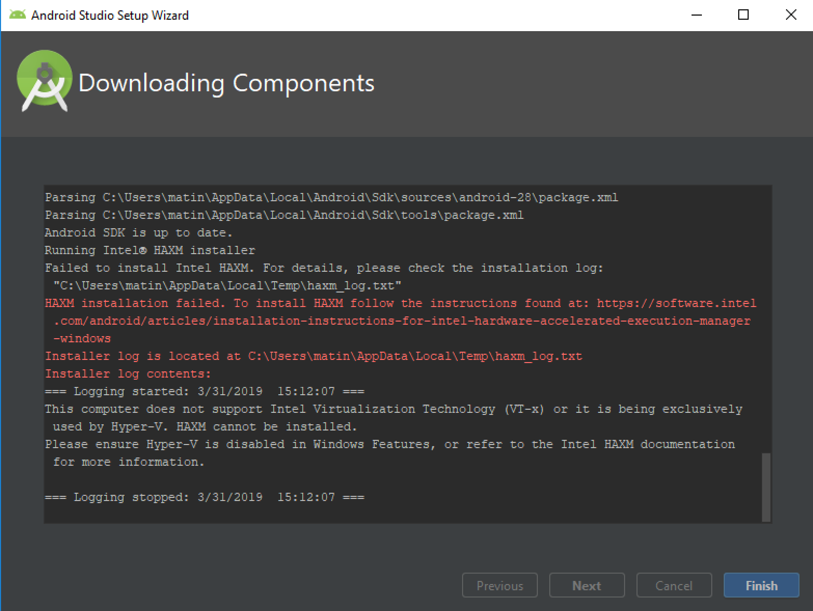

# Installing and Initializing React Native

## Before You Start

While working with VSCode lately, we've encountered this weird bug where VSCode automatically adds the package _console_ whenever we try to use our `console.log`. This breaks the application that we are trying to debug. To stop this from happening, you will to need to add `"javascript.suggest.autoImports": false` to your user settings. To do this, press `command+,` and click on the `{}` icon in the top right.


In the right-hand panel underneath where it says "USER SETTINGS", append the options to the list and then save. Do not overwrite any settings that you already have.

```json
  "javascript.suggest.autoImports": false
```

## Installing on Mac

Installing React Native is pretty painless on Mac OS because we have have most of what we need already installed (including an iOS simulator). However, you will need to install React Native, Watchman, XCode command line tools and the Expo client.

To begin, install Watchman:

```bash
brew install watchman
```

Then you will need to install React Native and the React Native dev tools:

```bash
npm install -g react-native-cli
npm install -g react-devtools
```

Next, you will need to the XCode command line tools. Try installing with this line of code:

```bash
xcode-select --install
```

If that doesn't work, follow the directions in https://shift.infinite.red/painless-react-native-setup-for-mac-windows-linux-956c23d2abf9

Finally, install the Expo client:

```bash
npm install -g expo-cli
```

## Installing on Windows

You computer will need to meet the following requirements. If doesn't, you will have to create your React Native application on Expo Snack (see Expo Snack section below).

- Intel processor with support for Intel VT-x, Intel EM64T (Intel 64), and Execute Disable (XD) Bit functionality
- At least 4 GB of available RAM, 8 GB recommended
  Supported Operating Systems:
- Microsoft Windows 10, Windows 8, Windows 8.1 or Windows 7 (32/64-bit)

Follow this React Native installation guide: https://medium.com/swlh/how-to-setup-your-development-environment-using-react-native-on-windows-768a14ff8aec

In addition, you should install the React Dev Tools and Expo:

```shell
npm install -g react-devtools
npm install -g expo-cli
```

If you see this error when you try to install Android Studio, see the Expo Snack below.



## Expo Snack

If your computer does not meet the minimum requirements, installation of HAXM failed or if you experience any other kind of computer trouble, you can use [Expo Snack](https://snack.expo.io/) to host your React Native project. You will need to create an Expo account. We only recommend this as a fallback.

## Initializing a React Project

To initialize a project, run this, where _MyProjectName_ is the name of your project. (Name it Bookstore for the second project).

```shell
react-native init MyProjectName
```

This will create a folder with all the files needed to run the project. Then navigate to your project and open in VSCode:

```shell
cd MyProjectName # or whatever you named the project
code . # if you want to open in VSCode
```

For Mac users, you can run your app in iOS with this command. It will take a few minutes to compile and start.

```shell
react-native run-ios
```

For Windows users (or Mac users who also install Android Studio), you can run your app in the Android simulator with this command. It will take a few minutes to compile and start.

```shell
react-native run-android
```

## Resources

- [General Documentation](https://facebook.github.io/react-native/docs/getting-started)
- [Debugging](https://facebook.github.io/react-native/docs/debugging)
- [Styles Cheatsheet](https://github.com/vhpoet/react-native-styling-cheat-sheet#text)

React Native soley relies on Flexbox for layout. Here are some resources on Flexbox:

- [CSS-Tricks Guide](https://css-tricks.com/snippets/css/a-guide-to-flexbox/)
- [Real-Time Tool](http://flexbox.help/)
- [Flexbox Patterns](https://www.flexboxpatterns.com/)
- [Flexbox Froggy](http://flexboxfroggy.com/)
- [What the Flexbox?](https://flexbox.io/)
