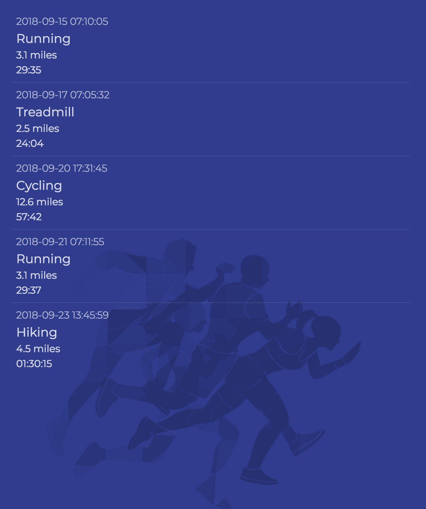

# React Stateless Components - Fitness Tracker App

In Visual Studio code, press `command+shift+v` (Mac) or `ctrl+shift+v` (Windows) to open a Markdown preview.

## Getting Started

Using your command line, you will need to navigate to the _exercises/10-react-components_ folder, install all dependencies, and start the app.

```bash
cd exercises/10-react-components
code . # if you would like to open this in a separate VSCode window
yarn install
yarn start
```

If, at any time, you need to stop the app, press `ctrl+c`.

## Exercise Instructions

You will be creating a fitness tracker app, which displays stats on a user's latest workouts. Complete the two stateless React components (_FitnessActivity_ and _FitnessTracker_) for this app.

Here are the files in this exercise:

- _src/FitnessTracker.jsx_ - you will be making changes to this file and this file only. Further instructions are in this file.
- _src/FitnessTrackerActivities.json_ - this is the source for your data. While you will not need to make any changes to this file, I suggest you open it so that you can see the shape of your data.
- _src/FitnessTracker.css_ - provides all the styles for the app. You will not need to edit this file.

The completed fitness track app should look like this:

